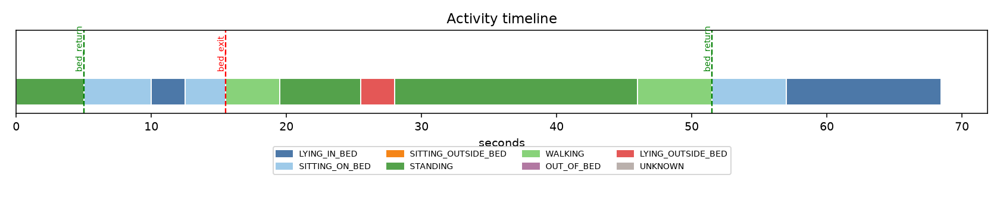
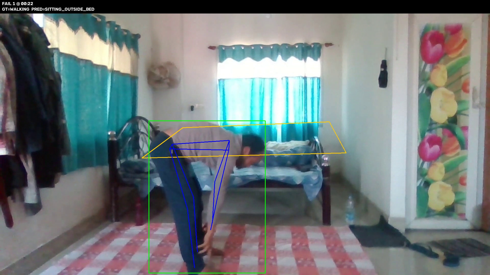
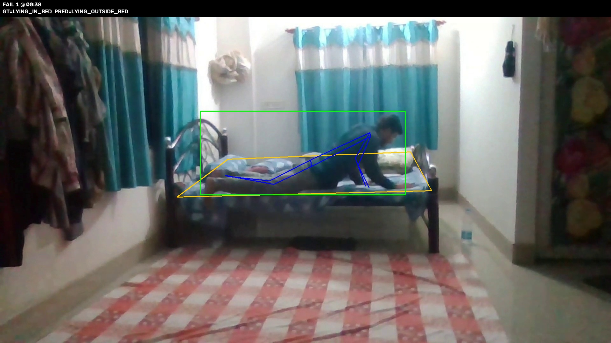
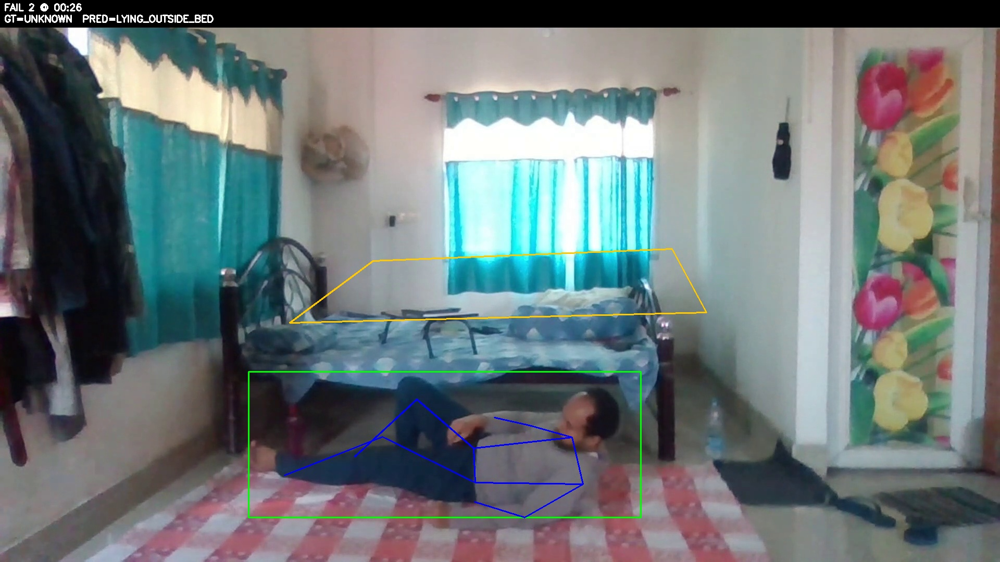

# Elderly Bed-Monitoring Agent

An agentic vision system that analyses a continuous indoor video of an elderly person and reports:

1. What the person is doing over time (activity timeline),
2. Bed exits and returns,
3. How long they spend in each state,
4. a **NORMAL / MONITOR / ALERT** decision with the reasoning behind it.

The emphasis is on temporal understanding, state tracking and agentic decision-making rather than a polished application. Everything runs from a CLI; there is no frontend.

---

## 1. Architecture

```
video ──► frame sampler (2 fps)
             │
             ▼
   YOLOv8-pose  (person boxes + 17 keypoints)
             │            └─► PatientSelector (locks onto the patient; other people = caregiver)
             │            Bed region (manual polygon, or YOLO "bed" class as fallback)
             ▼
   FrameClassifier   rules on torso angle, knee/hip geometry, bed overlap, motion speed,
             │       hidden-person logic  →  soft scores per state (UNKNOWN when unsure)
             ▼
   Temporal model    Viterbi decoding over a state-transition graph
             │       → segments → short-segment merging
             ▼
   TemporalAgent     observe → think → act → conclude (logged to agent_trace.txt)
             │       tools: previous / next segments, bed-overlap evidence
             │       • resolves UNKNOWN / low-confidence segments
             │       • verifies bed exit / return using look-back and look-ahead context
             ▼
   Alert rules  ──►  NORMAL / MONITOR / ALERT
             ▼
   Outputs: timeline, duration summary, bed events, plots, evaluation vs. ground truth
```

### Design choices

| Component | Choice | Why |
|---|---|---|
| Person + pose | **YOLOv8-pose** (pretrained on COCO) | One pass gives a box and keypoints, no training needed, runs on CPU at 2 fps. |
| Posture | Torso angle (shoulders→hips) and knee-below-hip distance / torso length | Interpretable and easy to debug: lying ≈ 90°, sitting → knees near hip height, standing → knees far below hips. |
| Bed context | Bed polygon + overlap of the person's box / hips with it | "Lying" alone is ambiguous (bed vs floor); the bed region disambiguates. |
| Motion | Hip-centre speed in body-heights per second over 2 s | Independent of camera scale; separates STANDING from WALKING. |
| Temporal model | **Viterbi decoding** with a transition graph | Penalises impossible jumps (e.g. LYING → WALKING), removes flicker and uses soft per-frame evidence, so states are tracked as transitions instead of independent frame labels. |
| Agent | Rule-based controller that chooses which context to inspect | Deterministic, testable and explainable; every decision is logged. |
| UNKNOWN | Emitted when keypoints are weak, posture is ambiguous or the person is hidden without context | Required by the brief; also drives the MONITOR rule. |

**Extra state:** `LYING_OUTSIDE_BED` (floor/sofa) is added so a possible fall can be flagged.

**Hidden person:** if the person disappears while last seen *on the bed*, the state is carried forward for up to 60 s with decaying confidence (blanket / occlusion). If last seen *off the bed*, after 3 s the state becomes `OUT_OF_BED` (left the camera view).

---

## 2. Setup and run

```bash
pip install -r requirements.txt
```

**Optional sanity test** (no video or models needed; uses synthetic data):

```bash
python tests/test_synthetic.py
```

**1. Mark the bed (recommended).** Click the 4 bed corners on the first frame, press ENTER, and paste the printed polygon into `config.yaml` as `bed_polygon`. If you skip this, the system tries to detect the bed automatically.

```bash
python tools/select_bed.py data/videos/test1.mp4
```

**2. Run on a video:**

```bash
python -m elder_monitor.run --video data/videos/test1.mp4 --out outputs/test1 --annotated
```

**3. Run with ground truth** (adds evaluation and failure-case frames):

```bash
python -m elder_monitor.run --video data/videos/test1.mp4 --out outputs/test1 --gt data/gt/test1.csv --annotated
```

On Windows, run it from the project root, for example `.\.venv\Scripts\python.exe -m elder_monitor.run ...`.

Detections are cached in `outputs/<run>/obs_cache.pkl`, so re-running after changing thresholds in `config.yaml` takes seconds. Delete the cache if you change the video or the bed polygon.

### Ground-truth format

`data/gt/<name>.csv`, labelled by hand while watching the video:

```
start,end,state
0:00,0:20,LYING_IN_BED
0:20,0:28,SITTING_ON_BED
0:28,0:32,STANDING
```

Valid states: `LYING_IN_BED, SITTING_ON_BED, SITTING_OUTSIDE_BED, STANDING, WALKING, OUT_OF_BED, LYING_OUTSIDE_BED, UNKNOWN`.
An optional events file (`time,event`, with `bed_exit` / `bed_return`) can be passed with `--gt-events`; otherwise events are derived from the state labels.

### Outputs (per run, in `outputs/<run>/`)

| File | Content |
|---|---|
| `timeline.txt`, `timeline.png` | activity timeline built from state transitions |
| `summary.json` | machine-readable duration summary, bed counts, overall decision, alerts |
| `summary_readable.json` | same, with `11m 42s` style durations |
| `events.json` | `bed_exit` / `bed_return` events with confidence and decision |
| `segments.json` | state segments with confidence |
| `agent_trace.txt` | the agent's step-by-step reasoning log |
| `evaluation.txt`, `evaluation.json` | accuracy, confusion, duration errors, bed-event precision/recall |
| `failures/*.jpg` | frames from the longest mismatched periods |
| `annotated.mp4` | video with skeleton, bed polygon and predicted state |

### Project layout

```
elder_monitor/
  core.py         states, data classes, helpers
  config.py       all thresholds
  perception.py   video sampling, bed region, YOLO-pose, patient selection
  classifier.py   per-frame posture reasoning
  temporal.py     Viterbi decoding, segment building and merging
  events.py       bed exit / return detection
  agent.py        agentic context gathering and uncertainty resolution
  alerts.py       NORMAL / MONITOR / ALERT rules
  report.py       summaries, timeline text and plot
  evaluate.py     metrics against ground truth
  visualize.py    annotated video and failure frames
  pipeline.py     glue
  run.py          CLI
tools/select_bed.py   click-to-define the bed polygon
tests/test_synthetic.py
```

---

## 3. How the agent works

The agent does not accept a single transition at face value. Example from `agent_trace.txt` (illustrative):

```
Observation : SITTING_ON_BED -> WALKING: person is beside/away from the bed.
Thought     : One transition is not enough to call a bed exit; need what happened before and after.
Action      : inspect previous segment            -> SITTING_ON_BED until 00:00:16
Action      : inspect following segments          -> WALKING(...) -> ... -> back in bed at 00:00:52
Conclusion  : BED_EXIT confirmed
```

- **Bed exit** is confirmed only if the person was in bed, is then off the bed for at least `min_out_sec` (10 s), and moves away (walking, sitting on a chair, out of view). Sitting up, turning in bed, or standing briefly and sitting back down are **not** counted as exits.
- **Bed return** requires an in-bed state sustained for at least `min_in_sec` (8 s).
- **Uncertain segments** (`UNKNOWN` or low confidence) are checked against their neighbours: the same state on both sides means temporary occlusion and is bridged; hidden between two in-bed states means still in bed under the blanket; otherwise the segment stays `UNKNOWN` instead of guessing.
- **Standing beside the bed** with no movement away is checked with bed-overlap evidence before deciding.

---

## 4. Alert logic

| Level | Rule | Reasoning |
|---|---|---|
| ALERT | Out of bed for at least `alert_out_sec` | Unexpected prolonged absence (fall, wandering) |
| ALERT | `LYING_OUTSIDE_BED` for at least 5 s | Possible fall |
| MONITOR | Bed exit just confirmed | Watch for the return; final decision becomes NORMAL if the person returns within `monitor_out_sec` |
| MONITOR | Out of bed for at least `monitor_out_sec` | Long trip |
| MONITOR | Sitting on the bed edge for at least `monitor_edge_sec` | Restlessness, dizziness or fall risk |
| MONITOR | `UNKNOWN` for at least 30 s | Activity cannot be determined confidently |
| NORMAL | Otherwise | Lying, sitting, standing or walking normally |
| Downgrade | A second person (caregiver) is present near an alert | Person is probably being assisted; severity drops one level |

Each exit event carries two decisions: `decision` at confirmation time (MONITOR) and `final_decision` once the outcome is known (for example NORMAL after a 36 s trip that ended with a return).
The 5-second persistence requirement on the fall rule is what stops brief misclassifications from raising alarms (see failure case 3).
Thresholds are set for short test clips (`monitor_out_sec` 120 s, `alert_out_sec` 300 s). For real overnight monitoring they should be scaled up (for example 15 and 30 minutes) and personalised per resident.

---

## 5. Difficult cases and how each is handled

| Case | Handling |
|---|---|
| Turning while lying in bed | Torso stays horizontal and on the bed → still `LYING_IN_BED` |
| Sitting up, not leaving | `SITTING_ON_BED`, no exit event |
| Sitting on the edge of the bed | Hips on bed, feet off bed → flagged; long duration triggers MONITOR |
| Standing briefly and sitting back down | Exit rejected because off-bed time is under `min_out_sec` |
| Leaving / returning | Confirmed with look-back and look-ahead context |
| Sitting on a chair | `SITTING_OUTSIDE_BED` |
| Walking around the room | `WALKING` from hip speed |
| Partially hidden by blanket | Hidden-person carry-forward and bridging rules |
| Temporary occlusion | Bridged when the same state appears on both sides |
| Caregiver entering | Patient locked by position continuity; alerts downgraded while a caregiver is present |
| Poor lighting | Weak keypoints → `UNKNOWN` rather than a forced guess |
| Person leaves camera view | `OUT_OF_BED` after a short grace period |

Not every case is covered by my test clips (see Limitations).

---

## 6. Results

Three clips were recorded and labelled by hand (1920×1080, fixed camera). Detailed results for `test1` are below. **The full outputs for all three clips are in the `outputs/` folder:** `outputs/test1/`, `outputs/test2/` and `outputs/test3/` (timeline, summary, events, evaluation, failure frames).

### Summary across all clips

| Clip | Length | Frame accuracy | Mean abs. duration error | Bed-exit P / R | Bed-return P / R | Overall decision |
|---|---|---|---|---|---|---|
| test1 | 68 s | **93.4 %** | 1.0 s | 1.00 / 1.00 (1 exit) | 1.00 / 1.00 (2 returns) | NORMAL |
| test2 | 45 s | 84.4 % | 2.4 s | 1.00 / 1.00 (1 exit) | 1.00 / 1.00 (1 return) | ALERT (possible fall) |
| test3 | 33 s | 70.8 % | 3.2 s | 1.00 / 1.00 (1 exit) | no returns in clip | MONITOR (still out of bed) |

Duration-weighted frame accuracy over the three clips (146 s in total) is about **85 %**.

### Detailed results: test1 (68 s)

**Activity timeline** (generated from state transitions)



```
00:00 - 00:05  STANDING
00:05 - 00:10  SITTING_ON_BED
00:10 - 00:12  LYING_IN_BED
00:12 - 00:16  SITTING_ON_BED
00:16 - 00:20  WALKING
00:20 - 00:26  STANDING
00:26 - 00:28  LYING_OUTSIDE_BED
00:28 - 00:46  STANDING
00:46 - 00:52  WALKING
00:52 - 00:57  SITTING_ON_BED
00:57 - 01:08  LYING_IN_BED
```

**Duration summary**

```json
{
  "total_observation_time": "1m 08s",
  "activity_summary": {
    "lying_in_bed": "0m 14s",
    "sitting_on_bed": "0m 14s",
    "sitting_outside_bed": "0m 00s",
    "standing": "0m 29s",
    "walking": "0m 10s",
    "out_of_bed": "0m 00s",
    "lying_outside_bed": "0m 02s",
    "unknown": "0m 00s"
  },
  "bed_summary": {
    "time_in_bed": "0m 27s",
    "time_out_of_bed": "0m 36s",
    "bed_exit_count": 1
  }
}
```

**Bed events**

| Event | Start | Confirmed | Previous → current | Confidence | Decision |
|---|---|---|---|---|---|
| bed_return | 00:05 | 00:10 | standing → lying_in_bed | 0.71 | NORMAL |
| bed_exit | 00:16 | 00:18 | sitting_on_bed → walking | 0.71 | MONITOR → final **NORMAL** (returned after 36 s) |
| bed_return | 00:52 | 00:57 | walking → lying_in_bed | 0.64 | NORMAL |

The first event is a return because the person starts the clip standing beside the bed (already out of bed) and then gets in. The overall decision is **NORMAL**: the short `LYING_OUTSIDE_BED` blip at 00:26–00:28 lasts 2 s, below the 5 s needed for the fall rule.

**Evaluation against manual ground truth**

```
Frame-level state accuracy: 93.4%

Per-class:
  LYING_IN_BED           P=0.96 R=1.00 F1=0.98 (13s GT)
  SITTING_ON_BED         P=0.96 R=0.93 F1=0.94 (14s GT)
  STANDING               P=0.98 R=0.98 F1=0.98 (29s GT)
  WALKING                P=0.95 R=0.90 F1=0.92 (10s GT)
  LYING_OUTSIDE_BED      P=0.00 R=0.00 F1=0.00 (0s GT)
  UNKNOWN                P=0.00 R=0.00 F1=0.00 (2s GT)

State                       GT    Pred  AbsErr
LYING_IN_BED             00:13   00:14    0.5s
SITTING_ON_BED           00:14   00:14    0.5s
STANDING                 00:29   00:29    0.0s
WALKING                  00:10   00:10    0.5s
LYING_OUTSIDE_BED        00:00   00:02    2.5s
UNKNOWN                  00:02   00:00    2.0s
Mean absolute duration error: 1.0s

Bed events (match tolerance ±10s):
  bed_exit:   TP=1 FP=0 FN=0 precision=1.0 recall=1.0
  bed_return: TP=2 FP=0 FN=0 precision=1.0 recall=1.0
```

Duration errors are within about half a second for the main activities (lying, sitting, standing, walking). The largest error comes from the 2 s the person was labelled `UNKNOWN` by hand and the system called `LYING_OUTSIDE_BED`. The other listed confusions show 0 s because they are sub-second boundary shifts on the 0.5 s evaluation grid.

### Results on test2 and test3

- **test2 (45 s, 84.4 %)**: bed exit at 00:26 and return at 00:06 detected correctly. The system raised an **ALERT at 00:42** (`possible_fall`). The ground truth contains 5 s of `LYING_OUTSIDE_BED`, and the alert time falls inside it, but the predicted lying-outside period started about 4 s too early (failure case 2).
- **test3 (33 s, 70.8 %)**: bed exit at 00:09 detected correctly and the person stays out of bed (MONITOR). This is the weakest clip: walking is under-detected (recall 0.29, 5 s predicted as sitting, failure case 1).

Full evaluation text for each clip: `outputs/test1/evaluation.txt`, `outputs/test2/evaluation.txt`, `outputs/test3/evaluation.txt`.

### Failure cases

Frames for each case are saved automatically in `outputs/<clip>/failures/`.

| # | Clip / time | Ground truth → Predicted | Likely root cause | Possible fix |
|---|---|---|---|---|
| 1 | test3, 00:20–00:25 (5 s) | WALKING → SITTING_OUTSIDE_BED | Walking is decided by hip speed plus a knee/hip geometry test. In a 1080p wide view with partly visible legs, the knee-to-hip distance looks short, so the pose reads as "knees bent". Slow, shuffling steps or movement toward the camera also produce little hip displacement, so the speed cue stays below the walking threshold. | Use a per-person standing-height reference, add a longer motion window, and use ankle and bounding-box centre motion as extra walking cues. |
| 2 | test2, 00:36–00:40 (4 s) | LYING_IN_BED → LYING_OUTSIDE_BED | While lying down, the person overlaps the bed polygon less than the 20 % `bed_frac_out` threshold. Most likely the polygon does not cover the whole mattress, or the person lay at its edge. Since a torso with horizontal orientation and low bed overlap means "lying outside bed", the system called it a floor position. This moved the possible-fall alert earlier. | Draw the polygon to cover the full mattress, decide using hip position rather than box overlap, and have the agent check the preceding segment (a person who just approached or sat on the bed is likely to be lying down on it). |
| 3 | test1, 00:26–00:28 and test3, 00:25–00:28 (2–3 s) | UNKNOWN → LYING_OUTSIDE_BED | Brief, unclear posture (probably bending or being partly out of view) with a horizontal-looking torso and no bed overlap. The classifier is forced into the nearest posture instead of staying uncertain. The 5 s persistence requirement on the fall rule prevented a false alert in both clips. | Return `UNKNOWN` when a horizontal torso is accompanied by low keypoint confidence, and require both torso angle and bounding-box aspect ratio to agree before using `LYING_OUTSIDE_BED`. |

The remaining mismatches in the evaluation are sub-second shifts of segment boundaries (0.5 s grid) and are not treated as failures.





### Caveats on these numbers

- **The test set is small**: three short clips (33–68 s) with a few state changes each, so one wrong segment can move accuracy by several points. These results show that the pipeline works end to end; they are not a robust accuracy estimate.
- **Bed-event metrics are partly circular.** If no events file is supplied, ground-truth events are derived from my hand-labelled *state* sequence using the same exit/return rules as the system. The perfect precision and recall therefore show that the system's states are good enough to reproduce those events. They do not independently verify exit timing. A hand-labelled events file (`--gt-events`) would be a stricter test.
- Hand-labelled boundaries are only accurate to roughly ±0.5 s, so duration errors below that level are not meaningful.
- Thresholds were tuned while looking at these same clips, so there is no held-out test set.
- `tests/test_synthetic.py` checks the temporal, agent, event, alert and evaluation logic on synthetic per-frame data with a known answer. It validates the logic, not the accuracy on real video.

---

## 7. Limitations and what I would do with more time

- Walking detection is the weakest part (test3 recall 0.29). I would add ankle motion, a per-person standing-height reference and a longer motion window.
- The bed-overlap rule is sensitive to the bed polygon (failure case 2). A segmentation-based bed mask, or deciding on hip position with context from the previous state, would be more robust.
- Several difficult cases from the brief were not covered by my clips: caregiver entering, poor lighting, heavy blanket occlusion and leaving the camera view. Their handling is implemented but untested on real footage.
- The patient and caregiver are separated only by position continuity. Appearance embeddings (re-identification) would be more robust when people cross paths.
- Pose models struggle under heavy blankets and in the dark. An infrared camera or a low-light-tuned model would help.
- Alert thresholds should be personalised per resident (night routine, bathroom frequency) and evaluated on much longer recordings.
